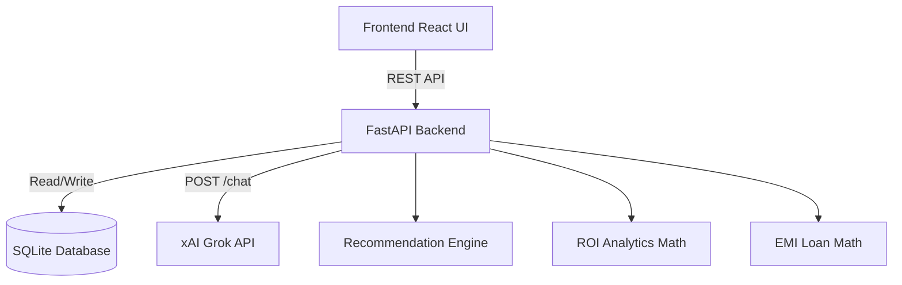
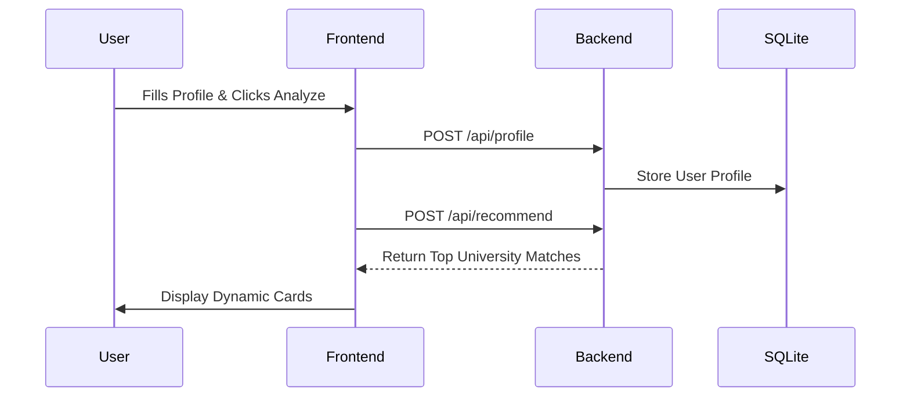

<div align="center">
  
  <h1>NextDegree AI</h1>
  <p><strong>A Full-Stack AI-Powered Study Abroad Planning Platform</strong></p>
</div>

<br/>

## 📖 Project Overview
**NextDegree AI** is an intelligent, automated study abroad mentor built for Indian students. It helps users select universities, analyze return on investment (ROI), estimate education loans, and chat dynamically with an integrated AI mentor.

This project was built from the ground up using **React**, **FastAPI**, **SQLite**, and the **xAI Grok API** to provide a real-time, interactive, and beautifully designed "startup-quality" prototype.

---

## 🎯 Problem Statement
Studying abroad requires navigating thousands of universities, complicated ROI estimates, and unclear loan eligibility. Existing tools are either rigid spreadsheets or expensive human counselors. NextDegree AI solves this by aggregating these workflows into a single dynamic dashboard.

---

## ✨ Core Features
1. **Dynamic Recommendation Engine**: Matches students with universities based on CGPA, GRE, and Budget.
2. **Fintech-Style ROI Analytics**: Calculates tuition, living costs, and projected post-graduation salary to output concrete ROI percentages and breakeven years.
3. **Education Loan & EMI Estimator**: Estimates monthly EMIs dynamically based on loan amount, duration, and family income to determine eligibility.
4. **Smart AI Mentor Chatbot**: Powered by the Grok API (`grok-2-latest`), an intelligent chat interface offering targeted advice on SOPs, visas, and university comparisons.
5. **Modern Dashboard Experience**: Features smooth animations (Framer Motion), dynamic data mapping, tabbed Recharts, and "Glassmorphism" UI patterns.

---

## 🛠 Tech Stack

### Frontend
- **React.js** (Vite)
- **Tailwind CSS** (Styling, Dark Mode, Micro-animations)
- **Framer Motion** (Page transitions & chat bubbles)
- **Recharts** (Interactive data visualizations)
- **React Hook Form** (Form state and validation)

### Backend
- **FastAPI** (Python web framework)
- **SQLAlchemy + SQLite** (ORM & lightweight local database)
- **Pydantic** (Payload validation)
- **xAI Grok API** (Generative AI Chatbot engine)
- **Uvicorn** (ASGI server)

---

## 📐 System Architecture



### Recommendation Flow



---

## 🚀 Installation & Setup

### Prerequisites
- Node.js (v18+)
- Python (3.10+)

### 1. Clone the repository
```bash
git clone https://github.com/yourusername/nextdegree-ai.git
cd nextdegree-ai
```

### 2. Frontend Setup
```bash
# Install dependencies
npm install

# Start the Vite development server
npm run dev
```
*Frontend runs at `http://localhost:5173`*

### 3. Backend Setup
```bash
cd backend

# (Optional but recommended) Create a virtual environment
python -m venv venv
source venv/bin/activate # (On Windows: venv\Scripts\activate)

# Install Python dependencies
pip install -r requirements.txt

# Create .env file from the example
cp .env.example .env
# Edit .env and add your XAI_API_KEY (Get from https://console.xai.com/)

# Start the FastAPI server
python -m uvicorn main:app --reload --port 8000
```
*Backend runs at `http://127.0.0.1:8000`*

---

## 📡 Core API Endpoints

| Method | Endpoint | Description |
|--------|----------|-------------|
| `POST` | `/api/profile` | Stores the user's academic and financial profile in SQLite |
| `POST` | `/api/recommend` | Runs the heuristic matching engine returning universities |
| `POST` | `/api/roi` | Calculates the total cost, projected salary, and 5-yr ROI % |
| `POST` | `/api/emi` | Generates a monthly amortization schedule & bank matches |
| `POST` | `/api/chat` | Proxies user messages to the Grok LLM for mentorship |

---

## 💼 Resume & LinkedIn Project Description

**NextDegree AI | Full-Stack Developer**
> *Built a full-stack AI-powered study abroad planning platform using React, FastAPI, SQLite, and the Grok API. Engineered a dynamic recommendation engine, a FinTech-style ROI & Loan estimation dashboard, and a conversational AI mentor, providing an end-to-end "startup quality" UX for prospective international students.*

---

## 📸 Screenshots & Demo Flow

*(When publishing to GitHub, replace these placeholders with actual screenshots of the application)*

- **Landing Page:** ``
- **Dashboard:** ``
- **ROI Analytics:** ``
- **AI Chatbot:** ``

### Quick Demo Walkthrough:
1. Open the **Profile** page and click the `Load Demo Profile` button.
2. Hit **Analyze** to generate real-time University Recommendations.
3. Click "Calculate ROI" on a university card to auto-fill the **ROI Analysis** dashboard.
4. Navigate to the **Loan Estimator** to view your EMI eligibility.
5. Visit the **AI Mentor** tab to ask Grok any follow-up questions about the suggested universities.

---

## 🔮 Future Scope
- Integration with live university APIs (e.g., College Scorecard)
- Multi-user authentication via JWT/OAuth
- PDF Export for loan sanction letters
- Advanced AI RAG (Retrieval-Augmented Generation) trained specifically on F-1 Visa rules.
